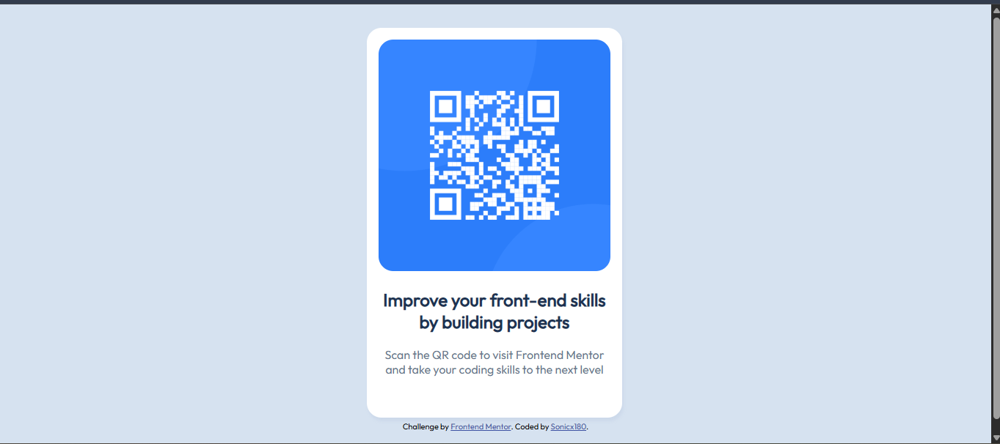

# Frontend Mentor - QR code component solution

This is a solution to the [QR code component challenge on Frontend Mentor](https://www.frontendmentor.io/challenges/qr-code-component-iux_sIO_H). Frontend Mentor challenges help you improve your coding skills by building realistic projects. 

## Overview

### Screenshot

### Links

- Solution URL: [https://github.com/sonicx180/qr-component](https://github.com/sonicx180/qr-component)
- Live Site URL: [https://sonicx180.github.io/qr-component](https://sonicx180.github.io/qr-component/)

### Built with

- Semantic HTML5 markup
- CSS Flexbox

### What I learned
I learned CSS Flexbox, and some CSS tips along the way.

### Continued development
For sure need to make more responsive

## Author
- Frontend Mentor - [@sonicx180](https://www.frontendmentor.io/profile/sonicx180)

